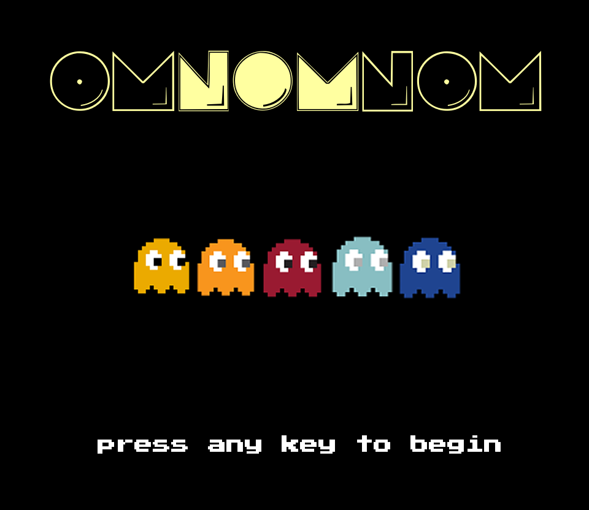

# omnomnom
_5C Hackathon 2017_

OMNOMNOM is a PAC-MAN clone with a unique control scheme that uses the player's own face as input.

Players can control their character by turning their head in the direction they would like to move, and then making their best imitation of a PAC-MAN-esque mouth motion. We highly recommend saying "OMNOMNOM" while doing this for the best gameplay experience.

The game itself is built in C++, but also makes use of the [face_recognition](https://github.com/ageitgey/face_recognition) Python library, which allows us to locate the main features of the player's face and use them to compute inputs.
